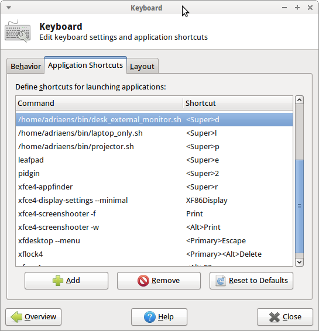

I see quite some people who use Linux fiddling with external display settings when they have to give a presentation. I have configured my Xubuntu 12.04 to make this a lot easier. 

What I explain should also work with regular Ubuntu or any other recent Linux distribution.

It wouldn't be Linux if there are no command-line tools that allow you to change display settings. The flexibility of those command-line tools is that you can configure keyboard bindings that execute the comand-line tool.

I'm using [disper](http://willem.engen.nl/projects/disper/) because I have NVidia graphics hardware in my laptop and am using the proprietary driver. If you are not using NVidia graphics hardware or the [nouveau drivers](https://nouveau.freedesktop.org/wiki/) you can use [XRandR](https://www.x.org/wiki/Projects/XRandR/) instead. Or it might also be worth checking out [autorandr](https://github.com/wertarbyte/autorandr) which can automatically detect display configurations based on connected devices.

I typically need to use my laptop in 3 modes when it comes to screen configuration:

   1. Laptop screen only: When I'm not at my work desk and not sharing my screen.
   2. External screen in extended desktop mode: When I'm at my desk where I have a 24inch monitor I want this monitor to be the primary display and my laptop screen to be an extension so I can drag windows from the main display to the laptop screen and vice versa.
   3. External screen in mirroring mode: When I'm sharing my screen with others, for example during a presentation, I want my laptop display to be mirrored on an external screen or projector.

## Shell scripts

For each of these settings I made a shell script that adapts my screen setup accordingly.

### \~/bin/laptop_only.sh

```
disper -d DFP-3 -r auto -s
```

DFP-3 identifies my laptop display. To get the right name for your display execute *disper -l* which shows you the attached displays.
What this command does is making display DFP-3 active and the primary display (*-d DFP-3*), choose the best resolution automatically (*-r auto*) and enable only the primary display (*-s*). 

### \~/bin/desk_external_monitor.sh

```
disper -d CRT-0,DFP-3 -r auto -e -t right
```

This command activates both my external display CRT-0 (again execute *disper -l* with your external display attached to get the display name for your machine) and the laptop screen. The first mentioned display is the primary display. So in this case this is my external screen. It selects the best resolution for each of the displays automatically. It extends the display (*-e*) and the extension is to the right (*-t*). Laptop is right of the external screen.


### \~/bin/projector.sh

```
disper -d CRT-0,DFP-3 -r auto -c
```

Again this command activates both my displays. It automatically chooses the best resolution for each of the displays but this time it clones the displays (*-c*). 


## Keyboard bindings

Next I configured keyboard shortcuts that execute each of the scripts so I can easily switch between the different modes:

   1. Windows key + l : Executes *laptop_only.sh*
   2. Windows key + d : Executes *desk_external_monitor.sh*
   3. Windows key + p : Executes *projector.sh*


<br>
*Xubuntu keyboard application shortcuts*

You can see the keyboard shortcuts configuration for Xubuntu in above screenshot (<Super> = Windows key).

## Any issues?

I have been using this configuration for about half a year now. What I have noticed is that the primary display is always at the left side when extending my desktop across two displays. Trying to set the primary display to the right didn't work for me when using disper.


With older screens or projectors it can also be that the refresh rate is not properly adapted. In that case you can still execute the NVidia control panel to manually adapt the refresh rate.  With newer displays the auto detection of resolution and refresh rate seems to work great.