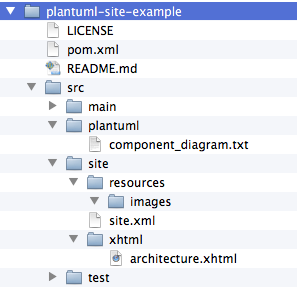

I like to use the [Maven site plugin](http://maven.apache.org/plugins/maven-site-plugin/) to generate documentation for a project because it has the advantage that the documentation is versioned together with the source code and that the site is generated automatically when releasing your software using the [Maven release plugin](http://maven.apache.org/maven-release/maven-release-plugin/).

The project information and reports that you can automatically generate for any Java project like a short description, javadocs, fixme and todo's, team information,... are all very nice but often I like to add some more detailed information including a component diagram or some high level sequence diagrams and that's where [PlantUML](https://plantuml.com) is a perfect fit.

PlantUML has a simple and easy to learn language for creating UML diagrams like Class Diagrams, Sequence Diagrams, Component Diagrams (and others). This means that you can create your diagrams using a simple text editor and PlantUML will convert your diagram into an image file, for example a `png`. 

With PlantUML you don't create your diagrams by drawing boxes and connecting them. The drawing and layout are done for you.  While this might seem odd at first I found it to be far more efficient for most diagrams than any other visual tool I have used so far. (only for larger component diagrams it can be tricky to get the layout right). 

Other advantages of PlantUML are:
   * The diagram definition is a human readable text file so it can be easily versioned and you can diff it. 
   * There is integration with lots of popular tools like Eclipse, wiki's (for example Confluence), Maven and even MS Word. I use the Eclipse plugin to create new diagrams as it gives you direct feedback. The image is generated when editing.

To be able to add UML diagrams to your Maven site we will use a PlantUML Maven plugin. I use the [plugin](https://github.com/jeluard/maven-plantuml-plugin) that is created by [Julien Eluard](https://github.com/jeluard).

In the example that I explain below we'll add a new menu item to the existing maven site named "Architecture" which will contain a PlantUML diagram image that will be auto-generated during site creation.

The project explained below is also available on [GitHub](https://github.com/kristofa/plantuml-site-example).

## Adding a new menu item to the Maven site

<br>

First we will add the new "Architecture" section to our site. To do this you'll have to create a file named `src/site/site.xml` in your project directory. See above screenshot.

The content of the `site.xml` file looks like this:


```xml
<?xml version="1.0" encoding="UTF-8"?>
<project xmlns="http://maven.apache.org/DECORATION/1.3.0"
    xmlns:xsi="http://www.w3.org/2001/XMLSchema-instance"
    xsi:schemaLocation="http://maven.apache.org/DECORATION/1.3.0 http://maven.apache.org/xsd/decoration-1.3.0.xsd">
  <body>
    <menu name="Project">
      <item name="Architecture" href="architecture.html"/>      
    </menu>  

    <!-- Make sure we still add regular reports -->
   <menu ref="reports"/>    
    
  </body>
</project>
```

What we do here is redefining the default report structure by adding a menu with the name of our project and underneath that menu we add an item called "Architecture" which links to architecture.html.

The menu item with reference to reports makes sure we still have a link to the other generated reports like Javadoc, tag list etc.

Next we can create the content of the architecture section. To do this create following file in your project directory: `src/site/xhtml/architecture.xhtml`. You can edit the file with your favourite html editor.

Example content of architecture.xhtml:

```xml
<?xml version="1.0" encoding="UTF-8"?>
<!DOCTYPE html PUBLIC "-//W3C//DTD XHTML 1.0 Transitional//EN" "http://www.w3.org/TR/xhtml1/DTD/xhtml1-transitional.dtd"><html
  xmlns="http://www.w3.org/1999/xhtml">
  <head>
    <title>Project Architecture</title>
    <meta http-equiv="content-type" content="application/xhtml+xml; charset=UTF-8" />
  </head>
  <body>
    <h1>Architecture</h1>
     <br />
  </body>
</html>
```

The html content only contains a title "Architecture" and a reference to an image named `component_diagram.png` in the relative path images. This image does not exist yet but when the site will be built it will get generated for us by PlantUML.

## Configuring PlantUML Maven plugin

One thing left to do before we can build our site is configuring the Maven plugin.
In the build -> plugins section of your `pom.xml` add the definition and configuration of the PlantUML plugin:


```xml
<plugin>
    <groupId>com.github.jeluard</groupId>
    <artifactId>plantuml-maven-plugin</artifactId>
    <version>7941</version>
    <configuration>
     <sourceFiles>
         <directory>${basedir}</directory>
           <includes>
             <include>src/plantuml/**/*.txt</include>
            </includes>
        </sourceFiles>
  <outputDirectory>${basedir}/src/site/resources/images</outputDirectory>
    </configuration>
 <executions>
  <execution>
   <phase>pre-site</phase>
   <goals>
    <goal>generate</goal>
   </goals>
  </execution>
 </executions>
</plugin>
```

This plugin is configured to only run in the pre-site build phase and it will process all `txt` files found in `src/plantuml` and create a png file for each diagram in `src/site/resources/images`.

## Building the site

Finally you can create the site including the generated PlantUML diagrams by executing:

```
mvn site
```

This will execute `pre-site` and `site` build phases. The PlantUML plugin is configured to run in `pre-site` phase and in the `site` phase the `site:site` goal will be executed which will create the site in `target/site`.


What happens is:
   * The `pre-site` phase is run first. This will trigger the PlantUML plugin which will take the diagram definition in `src/plantuml/component_diagram.txt` and create a png  for the diagram `src/site/resources/images/` 
   * Next the `site` phase is run. At this phase the xhtml files in `src/site/xhtml` will be converted to html files and copied to `target/site`
   * Also in the site phase the content of `src/site/resources/images` will be copied to `target/site/images`

And that's when everything falls into place and the component diagram image is correctly referenced from the html file.

If you also want to deploy your site instead of only generating it locally you can execute:

```
mvn site-deploy
```

Deploying will not work with the example project as the site url in the distributionManagement section of `pom.xml` points to an invalid url.

As mentioned earlier `site-deploy` is also executed by the Maven Release Plugin so with each release your site will get deployed as well.

Screenshot of the resulting site which is generated in `target/site` :

<br>

Get the example project in [Github](https://github.com/kristofa/plantuml-site-example).

