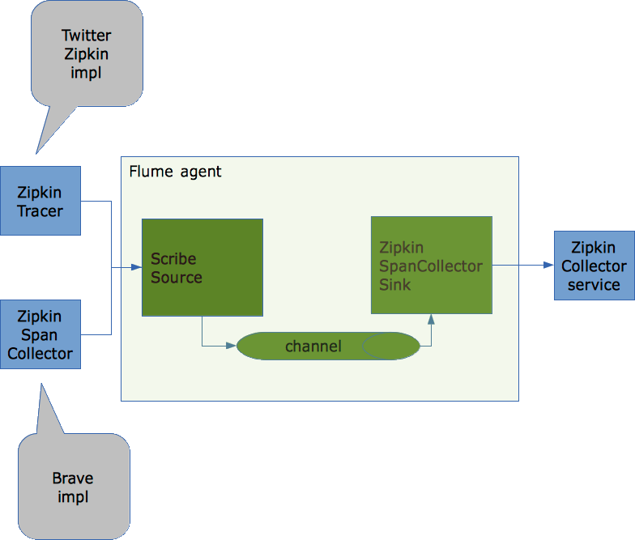

Using [Apache Flume](https://flume.apache.org) or another transport/messaging system allows you to decouple the consumers from the producers of the data you generate. It allows you to have multiple consumers without changing the system that produces the data and it can also deal with failures by buffering the data in case consumers are temporary unavailable and resending the data when consumers are operational again.

I wrote a [Flume Sink](https://github.com/openzipkin-attic/flume-zipkin-collector-sink) a while ago that supports transporting [Zipkin](https://github.com/twitter/zipkin) spans to the Twitter Zipkin Collector Service.  The Flume setup can be used as a replacement for [Scribe](https://github.com/facebookarchive/scribe) which isn't supported anymore.

To make it work in its most basic setup you should configure Flume as following:

<br>
  

The set up described in the drawing works but it would be nice to be able to support sending spans to multiple Zipkin collector service instances instead of just one. This both for scalability and avoiding a single point of failure.

When reading through the Flume documentation in more detail I found out that Flume supports this.  You can use a specific sink group/processor called `LoadBalancingSinkProcessor`. This sink processor groups several sinks and is able to balance load between them.  The selection mechanism for sinks can be random or round robin.  It is also able to deal with failing sinks by avoiding them and using an optional [exponential back-off](http://en.wikipedia.org/wiki/Exponential_backoff) strategy.

Example of Flume configuration with load balancing between two Zipkin collector services.

```
agent1.channels.ch1.type = memory

agent1.sources.scribe-source1.channels = ch1
agent1.sources.scribe-source1.type = org.apache.flume.source.scribe.ScribeSource
agent1.sources.scribe-source1.port = 1463

agent1.sinks.zipkin-sink1.channel = ch1
agent1.sinks.zipkin-sink1.type = com.github.kristofa.flume.ZipkinSpanCollectorSink
agent1.sinks.zipkin-sink1.hostname = collectorhost1
agent1.sinks.zipkin-sink1.port = 9410
agent1.sinks.zipkin-sink1.batchsize = 25

agent1.sinks.zipkin-sink2.channel = ch1
agent1.sinks.zipkin-sink2.type = com.github.kristofa.flume.ZipkinSpanCollectorSink
agent1.sinks.zipkin-sink2.hostname = collectorhost2
agent1.sinks.zipkin-sink2.port = 9410
agent1.sinks.zipkin-sink2.batchsize = 25

agent1.channels = ch1
agent1.sources = scribe-source1
agent1.sinks = zipkin-sink1 zipkin-sink2
# Define our sink group
agent1.sinkgroups = g1
# Define sinks part of sink group
agent1.sinkgroups.g1.sinks = zipkin-sink1 zipkin-sink2
# Indicate we want to load balance between sinks
agent1.sinkgroups.g1.processor.type = load_balance
# Sink selection is round robin
agent1.sinkgroups.g1.processor.selector = round_robin
# Indicate that in case of failing sink we want to exponentially back-off
agent1.sinkgroups.g1.processor.backoff = true
# Max back-off time in milliseconds
agent1.sinkgroups.g1.processor.selector.maxTimeOut = 300000
```

As you can see 2 sinks are defined. Both are configured to send spans to different hosts (`collectorhost1`, `collectorhost2`).

Both sinks are registered with the agent and also assigned to our sink group `g1`. Next we configured our sink group:

   * sink group / processor type = load balance
   * selection mechanism = round robin
   * back off strategy = true
   * max back-off time = 5 minutes

This configuration means Flume will switch between both sinks in round robin fashion. In case one of the sinks is unable to process events because the zipkin collector service is down it will continue to use the other sink. It will still try out the failing sink but in case of successive failures it will increase the back-off time with the maximum time as limit.  So as long as one sink is still functioning events/spans will be delivered.  You can of course configure more than 2 sinks to further improve redundancy and scalability.

Besides only sending spans to multiple zipkin-collector instances you could also change the Flume configuration to introduce more sinks or sinkgroups. For example if you would want to store spans on HDFS for bulk processing / aggregation you could configure an additional sink. This is where we would definitely benefit even more from using a system like Apache Flume.

