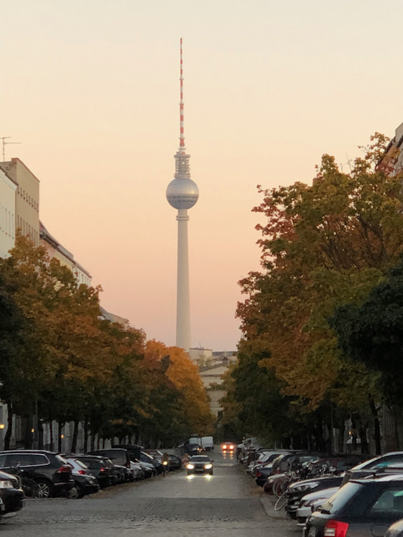
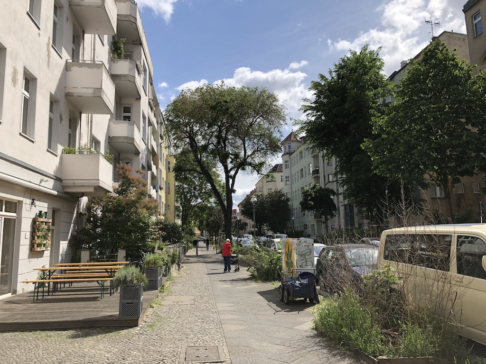
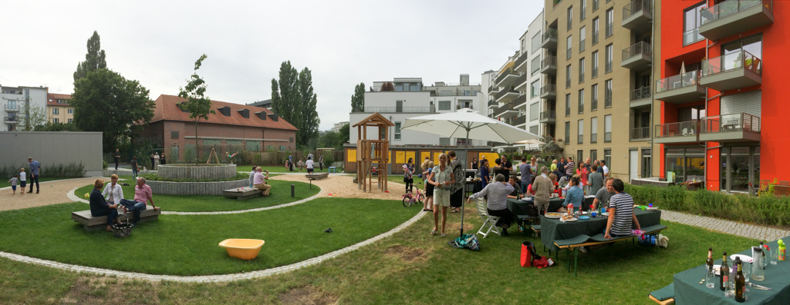
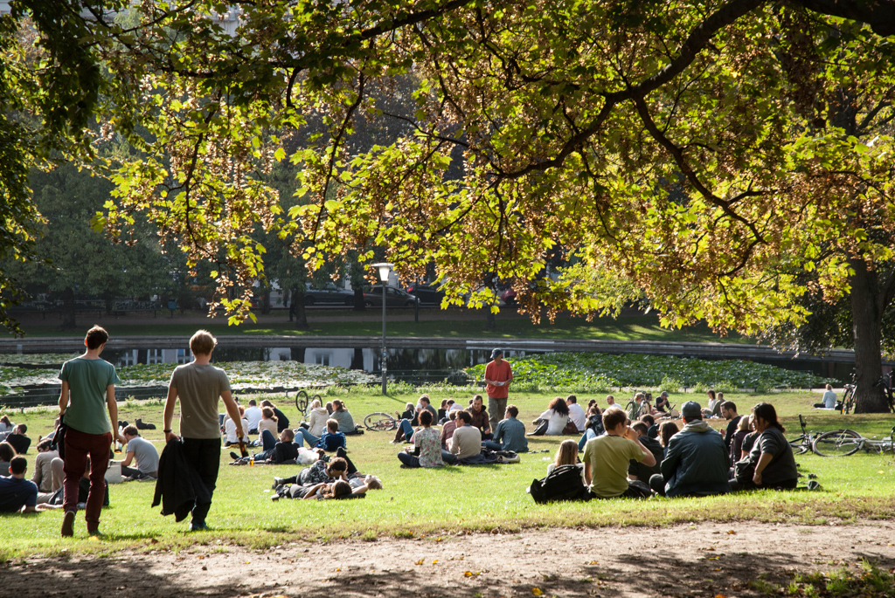
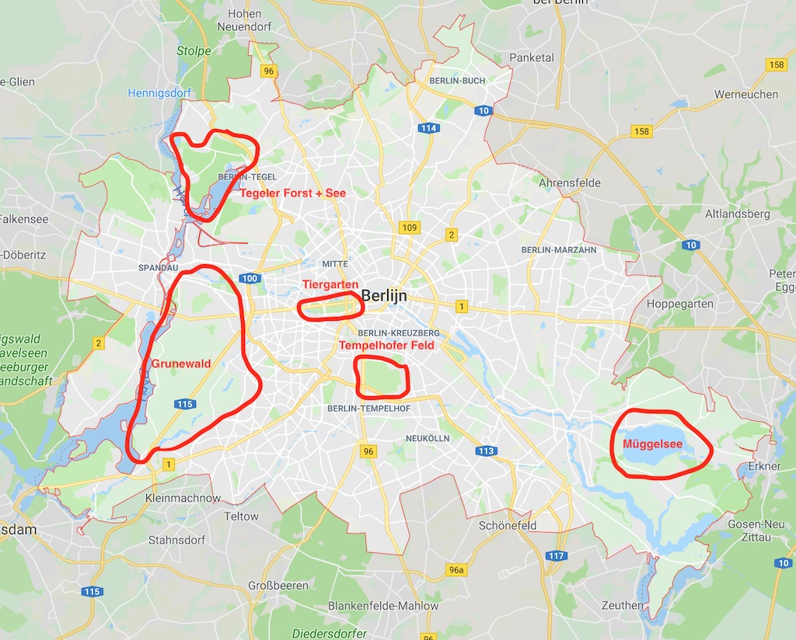
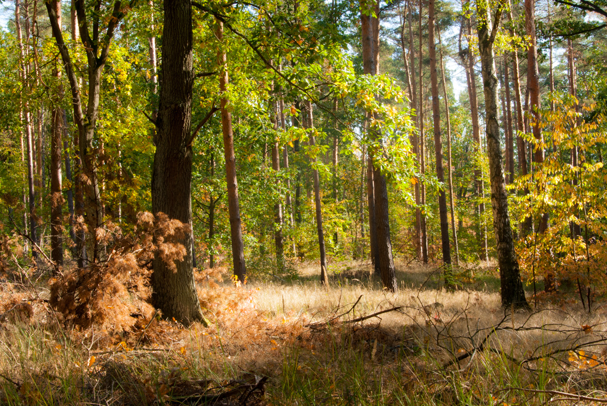
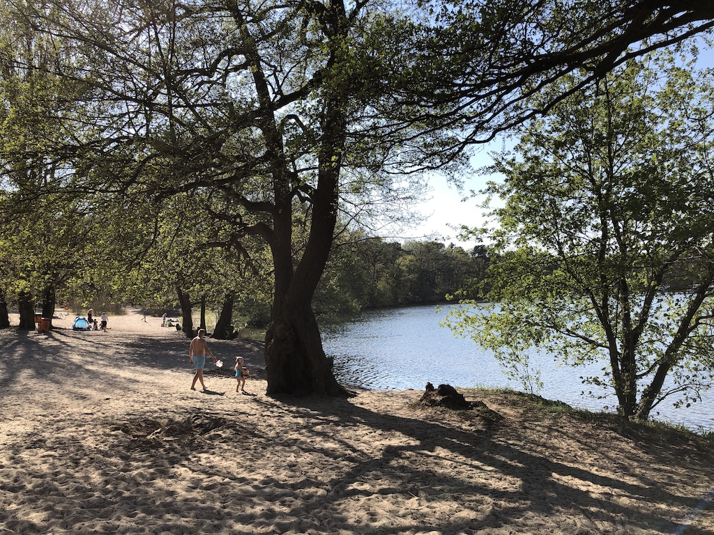

_This post is written in Dutch as it compares living and working in Berlin, Germany with Flanders, Belgium. I think the comparisons and insights are most useful for people living in Flanders whose main language is Dutch._

Ik heb de eerste 35 jaar van mijn leven in Vlaanderen, België gewoond, en het grootste gedeelte van mijn volwassen leven woonde ik in Gent.  Bijna 5 jaar geleden ben ik samen met mijn partner verhuisd van Gent naar Berlijn. De reden van de verhuis was een job bij [SoundCloud](https://soundcloud.com) die ik niet aan me wou laten voorbij gaan.

Het leven is hier anders en Ik denk dat het interessant kan zijn om inzichten en ervaringen te delen.

## Wonen

Berlijn is zeer uitgestrekt maar als bewoner hoef je voor de meeste zaken niet buiten je buurt (in Berlijn noemen ze dit [Kiez][1]). Doordat mensen dichter bij mekaar wonen vind je praktisch altijd op wandelafstand een supermarkt, bakkers, apothekers, restaurants, een park, dokters, tandartsen.  Er is een goeie mix van wonen, werken, cultuur en natuur binnen de stad.

Berlijn heeft iets meer dan de helft van het aantal inwoners ([3.7 miljoen eind 2018][16]) vergeleken met Vlaanderen op een derde van de oppervlakte van Oost-Vlaanderen. Toch voelt de stad voor mij op vele plaatsen minder druk dan pakweg Gent of Antwerpen.

Eén van de redenen hiervoor is volgens mij de breedte van de straten en voetpaden. In België kan je in de meeste steden amper met twee naast mekaar lopen op het voetpad. In Berlijn zijn de meeste voetpaden minstens zo een vier meter breed. Ik snap dat men in België de middeleeuwse stadscentra wil behouden maar als de stad uitbreidt zou men hier toch kunnen van afwijken. De breedte van de straten in Berlijn, vaak ook met bomen langs beide kanten van de straat, geeft veel meer ruimtegevoel en voelt minder druk aan.  De bomen in de straten zorgen ook voor schaduw wat zeer welkom is tijdens warme zomers zoals vorig jaar. De straten nodigen uit tot wandelen en verkennen.

De brede voetpaden betekenen ook genoeg plaats voor terrasjes voor restaurants, koffiezaken of cafés en ze worden ook gebruikt door kinderen wanneer ze met de fiets naar school gaan vooral op plaatsen waar er geen aparte fietspaden zijn.

Het stratenplan heeft haast een gridstructuur die bestaat uit enerzijds grote lanen met meerdere rijvakken in beide richtingen met daartussen kleinere straten.  Langs de grote lanen komt het meeste verkeer waardoor de kleinere straten rustiger zijn.  

 
*Zicht op Fernsehturm vanuit de Strelitzerstrasse*

 
*Typische Berlijnse straat in Moabit*

Bredere straten en voetpaden maar toch met meer wonen op minder oppervlakte betekent dat mensen dichter bij mekaar en kleiner wonen. Wij wonen met twee personen in een appartement van 90m2 met een terras, wat niet klein is naar Berlijnse normen.  Je vindt praktisch geen vrijstaande eengezinswoningen met tuin. Iedereen woont in een appartementsgebouw, bijna allemaal 5 of 6 verdiepingen hoog, dikwijls met een gedeelde binnenhof en soms een tuin.  De gedeelde tuin kan ingericht zijn met speeltuigen voor kinderen en de kinderen van bewoners kunnen er in een afgeschermde omgeving samen spelen.

 
*Bewonersfeest in gedeelde tuin*

De ruimte die ontstaat door dichter te wonen gaat niet alleen naar bredere straten maar ook naar parken en groenruimte. Er zijn [2500 parken en groene ruimtes in de stad][2].  De parken worden druk bezocht vooral tijdens de lente en zomer. 
Er zijn dikwijls ook schommels of andere speeltuigen voor kinderen. Het is een ontmoetingsplaats voor de gezinnen met kinderen uit de buurt die met mekaar in contact komen terwijl de kinderen spelen.  Terwijl in Vlaanderen veel gezinnen met kinderen de stad verlaten zie je in Berlijn veel gezinnen met kinderen in het straatbeeld.

 
*Weinbergspark*

Berlijn heeft ook goede sportinfrastructuur zeker als het op zwemmen aankomt. Als wekelijkse zwemmers hebben we binnen een straal van 4 km drie 50 meter zwembaden ter beschikking. In de lente en zomer (1 mei tot 31 augustus) komen er ook nog eens twee openluchtzwembaden bij, eveneens 50m, met aparte voorzieningen voor babies en kinderen.  Dit zijn publieke zwembaden, gefinancierd met belastingsgeld.

Elke buurt heeft zijn eigen karakter en er zijn ook buurten die nog eerder als een dorp aanvoelen zoals Alt Tegel, wat vroeger ook een apart dorp was maar inmiddels deel van Berlijn.

Er was in België veel commotie over het invoeren van statiegeld op plastic flessen en blikjes en uiteindelijk werd het niet ingevoerd.  In Duitsland is er dus statiegeld op plastiek flessen en blikjes al sinds we verhuisden in 2014.  Voor een leeg blikje cola of een PET fles krijg je 0.25 euro.  Je verzamelt je flessen en blikjes, steekt die in een machine in de supermarkt en je krijgt een bonnetje die aan de kassa in mindering gebracht wordt op je aankopen. Ik weet niet wat de impact was voor de supermarkten toen ze dit invoerden maar het gevolg is wel dat je geen blikjes en plastiek flesjes meer ziet op of langs de straten of in de natuur. Indien een toerist toch iets achterlaat wordt het wel meegenomen door een inwoner.  Het statiegeld heeft duidelijk zijn voordelen en staat niet onder discussie.

Tijdens de EU-vluchtelingencrisis die begon in 2015 kwamen er [enkel in het eerste jaar 55000 vluchtelingen naar Berlijn][3].  We kregen toen vragen of we er iets van merkten in Berlijn, van die vluchtelingencrisis. Wat we merkten is dat er tijdelijke opvangplaatsten verschenen voor vluchtelingen zoals bijvoorbeeld op Tempelhof maar los daarvan hebben we geen verschil gemerkt. Berlijn is al divers dus in het straatbeeld vielen deze vluchtelingen niet op.  Wij kwamen niet rechtstreeks met vluchtelingen in contact maar door hier te wonen kom je sowieso met mensen van verschillende achtergronden en nationaliteiten in contact. Op het werk. Of in het Vietnamees, Irakees, Lebanees of Indisch restaurant in de buurt. Of de moslima in de supermarkt in de rij aan de kassa die vraagt of je de rollen keukenpapier niet vergeten bent die achtergelaten zijn aan het einde van de transportband. Of de Turkse jongen onder de douche in het zwembad die vraagt of hij een beetje douchegel kan gebruiken omdat hij de zijne vergeten is.   [Cijfers uit 2017 tonen aan dat de criminaliteit in Duitsland met 10 percent gedaald is tegenover 2016 en dat ook het aantal niet Duitse daders van criminaliteit verminderde met 22.8 percent][4]. [De kosten gerelateerd met migratie liggen met 21 miljard euro in 2017 rond de 6,4% van alle kosten][5] en Duitsland had in hetzelfde jaar [een begrotingsoverschot van 36 miljard euro][6]. 55000 mensen in één jaar lijkt me niet niks voor een stad die al een tekort aan betaalbare woningen heeft. Maar van angst voor toenemende criminaliteit of het feit dat ze meer voordelen krijgen dan Duitse burgers is niks bewezen voor zover ik weet.

## Werken

[België heeft een grote belastingdruk op arbeid][7] maar mijn ervaring toont dat wat je netto ontvangt best meevalt vergeleken met mijn situatie in Duitsland. Dit ook mede door de uitzonderingen en voordelen die je ofwel niet hebt in Duitsland of die er minder evident zijn.

Bij mijn job in België had ik maaltijdcheques, ecocheques, vakantiegeld, dertiende maand, reiskostenvergoeding (onbelaste fietsvergoeding), groepsverzekering en een premie voor een salariswagen.  Ik verkoos een premie in plaats van een salariswagen omdat ik in Gent werkte en woonde en ik met de fiets naar kantoor ging. Aangezien ik kort bij het werk woonde en geen auto nodig had voor mijn werk vond ik het absurd om een salariswagen te nemen enkel voor privé gebruik. [De premie is niet zoveel waard als het werkelijke gebruik van de auto omdat ze bij het brutoloon geteld wordt en dus zwaarder belast wordt][8], maar dat was dan maar zo. Mijn partner had een auto, eerst een salariswagen maar de laatste jaren een eigen wagen.

In Berlijn heb ik geen salariswagen, geen dertiende maand, vakantiegeld of maaltijd- en ecocheques of reiskostenvergoeding.  Wel hebben we twee maal per week gratis lunch en  een jaarlijks learning & development en wellness budget. Ook heb ik het equivalent van een groepsverzekering waar zoals in België een deel wordt bijgedragen door de werkgever en een deel door de werknemer. In Berlijn heb ik 28 betaalde vakantiedagen wat min of meer overeenstemt met wat ik had in België. 

Als ik bruto met netto salarissen vergelijk tussen België en Berlijn lijkt er me niet zoveel verschil en kan België zelfs voordeliger uitkomen als je voordelen als een salariswagen in rekening brengt die vooral ten goede komen aan de beter verdienende middenklasse.

Wel hebben we gemerkt dat terwijl in Berlijn de huurprijzen vooral de laatste jaren duurder geworden zijn dan in Gent de meeste andere zaken zoals levensmiddelen, restaurantbezoeken, kosten telecomdiensten, goedkoper zijn dan in Vlaanderen.  De energiekosten in Duitsland zijn duur maar voor ons minder duur dan in België. Dit komt waarschijnlijk doordat we kleiner wonen in een goed geïsoleerd appartement die verwarmd wordt met [“stadsverwarming”][9].

De grootte van de stad, de diversiteit en internationaal karakter, en het groot aanbod van ICT jobs, maakt dat de stad aantrekkelijk is voor jonge mensen op zoek naar werk.  Bij SoundCloud werkten in 2014 meer dan 30 verschillende nationaliteiten.  De visie van de oprichters van SoundCloud was dat doordat ze een wereldwijd platform bouwden ze  ook talent uit de ganse wereld wilden aanwerven op locaties, zoals Berlijn, waar mensen bereid zijn om heen te verhuizen. In die opzet zijn ze zeker geslaagd.  Het kunnen werken in een dynamisch, internationale omgeving met gemotiveerde en gedreven mensen heeft me al veel bijgebracht. De collega’s die ik leerde kennen appreciëren de goede sociale voorzieningen, vrijheid en openheid, kwaliteit van het leven in de stad en de verschillende culturen en landen in Europa die makkelijk te bezoeken zijn.  De meesten blijven een aantal jaar maar hebben ondertussen wel belastingen betaald, ervaring opgedaan, kennis gedeeld en hun wereldbeeld verruimd. Naar mijn mening positief voor iedereen dus.

## Gezondheidszorg

Duitsland heeft twee gezondheidszorgsystemen: publieke en private gezondheidszorg. Voor het private systeem kan je kiezen indien je aan een minimum loon vereiste voldoet. Publieke gezondheidszorg is verplicht voor iedereen.

We kozen voor de publieke gezondheidszorg en eens je begint te werken sluit je je aan bij een ziekenfonds (Krankenkasse). Zoals in België wordt een deel van de bijdrage betaald door de werknemer, een deel door de werkgever en ook kun je je huisarts zelf kiezen. De basis gezondheidszorg is gratis en er is geen remgeld zoals in België. Basis gezondheidszorg betekent bezoek aan de huisarts, controle bij de tandarts en bepaalde tandheelkundige ingrepen, ziekenhuisbezoek en verzorging, bezoek dermatoloog/loge,...  Voor sommige ingrepen bij de tandarts moet je wel betalen. Voor een ziekenhuisopname betaal je meestal een vast bedrag per dag, 10 euro volgens onze ervaring. Ook voor medicijnen betaalden we tussen de 5 - 10 euro.

Als je kiest voor het private systeem kan je terecht bij dokters die enkel voor privaatverzekerden werken, worden er meer behandelingen terugbetaald bijvoorbeeld bij de tandarts en kan je bijvoorbeeld een privé kamer bekomen in het ziekenhuis zonder extra kosten.

We hebben spijtig genoeg wel al enige ervaring met de Duitse gezondheidszorg. Buiten de huisarts, tandarts, dermatoloog bezochten we ook al de spoedafdeling (nog nooit bezocht in België), uroloog en onderging mijn partner verschillende ingrepen in twee verschillende ziekenhuizen.

Alle dokterspraktijken die we al bezochten zijn groepspraktijken. We zijn erg tevreden van de verzorging en het verplegend personeel en dokters waren erg toegankelijk en nemen de tijd.  Ook al gebruiken we het publieke gezondheidszorg systeem, we hadden toegang tot zeer goeie zorg met nieuwe technieken. Wachttijden waren niet lang en we betaalden weinig extra geld. Het systeem lijkt ook efficiënter dan in België. Wat ons opviel: 

  * Door het ontbreken van remgeld hoef je niet eerst te betalen om dan een deel terug te krijgen. Minder administratie en de dokter wordt betaald door het ziekenfonds.
  * Voor een griepspuit kan je rechtstreeks naar de huisdokter gaan. Die heeft een voorraad inspuitingen in de praktijk waardoor je niet zoals in België eerst een voorschrift moet vragen, naar de apotheek, en dan terug naar de dokter.
  * Het lijkt dat er meer aan specialisatie wordt gedaan wat mogelijk is door de groepspraktijken. Bij de dokter bijvoorbeeld worden bloedafnames gedaan door een verpleger/verpleegster, niet door de dokter.  Bij de tandarts wordt een tandreiniging gedaan door een assistent/assistente.

## Mobiliteit

Ik werk in de ICT sector en terwijl in Vlaanderen een bedrijfswagen voor praktisch iedereen in deze sector een evidentie is geworden ken ik niemand in de ICT sector in Berlijn met een bedrijfswagen. Ik ken ook niemand die bij ons werkt die met een eigen wagen naar het werk komt. En er zijn ook geen parkeerplaatsen voorzien voor ons kantoorgebouw.  Iedereen komt met het openbaar vervoer met de fiets of te voet.  Dit is een evidentie en wordt niet in vraag gesteld.

Na enkele weken in Berlijn hebben we beslist om onze auto te verkopen.  Het openbaar vervoer werkt hier zo goed en is fijnmazig genoeg dat een auto overbodig wordt.  Ik betaal 63,42 euro per maand waarvoor ik onbeperkt gebruik kan maken van U-bahn, S-bahn, tram, bus en ferries binnen de stadsgrens (gebied van 891,8 km²).

[De verschillende vormen van publiek transport binnen de stad (de enkele ferry lijnen buiten beschouwing gelaten)][10]:

  * De U-bahn (metro) rijdt tijdens de week van 4u s’morgens to 1u s’nachts in intervallen van 5 minuten tijdens de dag en om de 10 minuten s’nachts. Tijdens het weekend rijdt de U-bahn 24 uur in intervallen van 10 minuten overdag en om de 15 minuten s'nachts.
  * De S-bahn rijdt langere afstanden, ook tot buiten Berlin in Brandenburg, met minder tussenstoppen.  De S-bahn rijdt tijdens de week van 4:30 s’morgens tot 1:30 s’nachts. Afhankelijk van het tijdstip rijden de treinen elke 5, 10 of 20 minuten. Tijdens het weekend rijdt de S-bahn 24 uur, s’nachts om de 30 minuten.
  * De buslijnen verbinden de buitenwijken met het centrum of rijden naar S-bahn of U-bahn stations. Er zijn ook een reeks nachtbussen die rijden als de U-bahn niet rijdt s’nachts. De frequentie staat niet vermeld op de website maar uit ervaring weet ik dat de bus tijdens de dag in 15 a 20 minuten intervallen rijdt.
  * De tramlijnen liggen vooral in het oosten van de stad. De verschillende lijnen hebben verschillende rijtijden. Ik gebruik dikwijls de M8, M10 en M12. De M10 rijdt tijdens de week om de 5 - 10 minuten. De andere iets minder frequent.

De U-bahn, bus, tram en ferry worden uitgebaat door de BVG (Berliner Verkehrsbetriebe), het stadsvervoerbedrijf van Berlijn.
De S-bahn wordt uitgebaat door de Deutsche Bahn maar ze gebruiken wel hetzelfde ticket systeem.

De nabijheid van openbaar vervoer ([iedereen in Berlijn heeft binnen een straal van 500m toegang tot openbaar vervoer][2]), weinig wachttijd, de beschikbaarheid tot laat s’avonds of s’nachts, de betrouwbare aanduidingen en de mogelijkheid om de fiets mee te nemen op S-bahn of U-bahn maken dat een auto voor mij geen beter alternatief is.  Een auto zou me veel meer kosten dan 63,42 euro per maand en zou me meestal niet sneller ter bestemming brengen.

[In 2017 vervoerde BVG 1.2 biljoen passagiers. 563 miljoen gebruikte U-bahn, 197 miljoen gebruikte de tram en 442 miljoen gebruikte bus of ferry][2].  Ter vergelijking, [de NMBS vervoerde in 2017 230 miljoen passagiers][11] en [de Lijn in 2016 519 miljoen passagiers][12].  BVG maakte ook voor [de eerste keer winst in 2014][13]. Het bedrijf doet het dus erg goed en [heeft een vrouw aan het hoofd][14].

Als we dan toch eens een auto willen gebruiken binnen de stad, bijvoorbeeld onlangs om bloemen en potgrond voor op het balkon en terras te gaan kopen, dan gebruiken we een deelauto van DriveNow. DriveNow was al beschikbaar in Berlijn toen we verhuisden in 2014 en wordt veel gebruikt (bestaat ook in Brussel).  Je registreert je en betaalt enkel bij gebruik. Er zijn altijd wel auto’s beschikbaar op wandelafstand die je vindt en reserveert met een app op je telefoon.

Als we een uitstap willen maken buiten Berlijn, wat we een paar keer per jaar doen, huren we soms ook een auto voor enkele dagen, bijvoorbeeld voor een uitstap naar de Ostsee of Spreewald. DriveNow kan je enkel gebruiken binnen de stad. Voor langere afstanden of meerdere dagen huren we bij een klassiek autoverhuurbedrijf.

Vele van mijn collega’s gebruiken hoofdzakelijk de fiets in plaats van het openbaar vervoer. Berlijn is niet de slechtste Europese stad voor fietsers maar zeker ook niet de beste. Door de grote bevolkingsgroei die tot drukker openbaar vervoer zal leiden zou het goed zijn om de fietsinfrastructuur te verbeteren. Berlijn is vlak en het regent er minder dan in België dus ideaal voor fietsers. 

## Natuur

Ik hecht veel belang aan natuur in de omgeving. In Gent was ik regelmatig te vinden in het natuurreservaat Bourgoyen-Ossemeersen en was lid van Natuurpunt.

Men zegt altijd dat het in Vlaanderen niet goed gesteld is met de groene ruimte en door naar Berlijn te verhuizen besef ik maar al te goed hoe groot het verschil kan zijn.  

[Rond de 30 percent van de oppervlakte in Berlijn bestaat uit groene ruimte en bossen][2].  Alleen al langs de straten staan er zo een 440000 bomen.  Bovendien zijn er ook grote stukken natuur en bos in de nabijheid zonder bewoning of gemotoriseerd verkeer. Ideaal om te ontspannen en te wandelen of fietsen. Enkele van mijn favoriete plaatsen op onderstaande kaart.

 
*Berlijn en mijn favoriete stukken natuur. Kaartgegevens, copyright GeoBasis-DE/BKG, Google*

   * Tegeler woud en meer: Het woud is 2169 hectare groot (9x zo groot als Bourgoyen-Ossemeersen, 230 hectare). Zeer rustig om te wandelen. Op het meer wordt er gezeild, er is een strand aangelegd en er kan natuurlijk gezwommen worden. Bereikbaar met het openbaar vervoer, 20 - 30 minuten van stadscentrum.
   * Grunewald: 3000 hectare (13x groter als Bourgoyen-Ossemeersen). Een groot woud, prima om te wandelen of fietsen. Perfect bereikbaar met de S-bahn in 25 minuten vanuit Hauptbahnhof. 
   * Tiergarten: Groot park midden in de stad, 210 hectare. Iets kleiner als Bourgoyen-Ossemeersen.
   * Tempelhofer Feld: De voormalige Tempelhof luchthaven, meer dan 300 hectare, die in 2008 sloot en sinds 2010 geopend is als park. Mensen komen er barbecuen, hardrijden met de fiets en ook kitesurfen op de voormalige landingsbanen is populair.
   * Müggelsee: Het grootste meer binnen de stadsgrens van Berlijn (7,4 km2). Leuk om met de fiets op de S-bahn naar Friedrichshagen te reizen, 30 - 40 minuten vanuit centrum Berlijn, om dan rond de Müggelsee te fietsen.

 
*Grunewald tijdens de herfst*

 
*Eén van de stranden rond de Müggelsee*

## Wat kan er beter in Duitsland en Berlijn?

Natuurlijk zijn er dingen die minder goed werken vergeleken met België of waar meer aandacht moet aan geschonken worden. Sommige al belangrijker dan andere.

Door de enorme bevolkingsaangroei, [rond de 40000 mensen per jaar][15], is er een tekort aan betaalbare woningen, kinderopvang en leerkrachten in Berlijn. Het tekort aan woningen en speculatie drijft de woningprijs omhoog en verdrijft de mensen met lagere lonen uit de stad of naar de rand van de stad.  De stad heeft maatregelen getroffen zoals het invoeren van een maximum stijgingspercentage voor huur maar er moeten vooral veel betaalbare woningen bijkomen en meer investeringen in kinderopvang en onderwijs. Door de bevolkingsaangroei merken we al duidelijk dat het openbaar vervoer drukker is vergeleken met 2014 en er zijn ook meer auto’s.  Inzetten op betere fietsinfrastructuur, verdere optimalisering van het openbaar vervoer en auto gebruik duurder maken zodat er overgeschakeld wordt op alternatieven zou volgens mij goed zijn om de stad leefbaar te houden met een groeiende bevolking.

Er zijn tussen de zes en achtduizend daklozen in Berlijn (gehoord op de regionale tv zender).  Er zijn plaatsen waar de daklozen terecht kunnen voor maaltijden, medische verzorging en in de winter ook voor onderdak maar het blijven enorm veel mensen die in erg slechte omstandigheden leven.

Wij hebben geen geluidsoverlast maar ik ken collega’s en kennissen die in het verleden wel regelmatig last hadden van lawaaihinder, ook tijdens de nacht.  Dit kan een nadeel zijn van in een stad dichter bij mekaar te wonen.  Strenge regels die nageleefd worden zijn hiervoor noodzakelijk want nachtrust en stilte zijn enorm belangrijk.

De Duitse deelstaten die voor de hereniging tot Oost-Duitsland behoorden hebben het economisch moeilijk vergeleken met de rest van Duitsland.  Na de hereniging hebben West Duitse bedrijven er fabrieksfilialen gevestigd om te kunnen profiteren van de staatssteun en goedkope werkkrachten maar recent zijn er vele gesloten om uit te wijken naar plaatsen waar het nog voordeliger is buiten Duitsland.  Dit heeft geleid tot een groot ongenoegen en machteloosheid bij de inwoners en samen met andere veranderingen zoals het toenemen van migratie geleid tot stemmen op populistische en extreem rechtse partijen.

Er is geen luchthaven die de stad waardig is.  Er is een nieuwe luchthaven gebouwd die al zeven jaar geleden opgeleverd moest worden maar waar steeds maar nieuwe structurele problemen opduiken. Niemand in Berlijn gelooft nog dat de luchthaven ooit opgeleverd gaat worden. 

De stadsdiensten voor bewoners (Bürgerämter) zijn niet de efficiëntste en nogal bureaucratisch. Wachttijd voor een afspraak is typisch veel langer dan in Gent.

Je kan niet zomaar uit eender welke bankautomaat, zelfs binnen Duitsland, geld halen zonder extra kosten te betalen wat een evidentie is in België. Als ik met mijn Deutsche Bank bankkaart geld wil afhalen bij een Sparkasse geldautomaat dan betaal ik extra. Bij andere banken, zoals de Commerzbank gaat het wel zonder extra kosten. Er zijn dus minder goeie afspraken tussen de banken die het klantonvriendelijker maken.

## Ten slotte

Ik besef dat ik dit schrijf vanuit een geprivilegieerde positie als blanke man en één van de winnaars van de mondialisering en het kapitalistisch systeem.  Ik had de optie om te verhuizen naar een ander land om er te gaan wonen en werken en heb een interessante baan met goed loon.

De afgelopen verkiezingen in België maar ook elders in Europa en de wereld tonen dat veranderingen velen afschrikt waardoor ze verlangen naar hoe het vroeger was. Dikwijls gebruiken ze migratie als zondebok.  Maar het toont ook dat onze Westerse democratieën de laatste decennia een groep mensen benadeeld heeft doordat neoliberalisme, winstbejag en individualiteit meer en meer aan belang won ten nadele van inclusiviteit en empathie.  Het politieke discours veranderde ook met minder samenwerking, nuance, context en hoop maar met meer slogans en verharding die aanzetten tot polarisatie en angst bij de bevolking. Dit alles wordt dan nog eens versterkt door de vele haatdragende berichten op o.a. Twitter en Facebook.

Door mijn verhuis naar Duitsland voel ik me nog sterker Europeaan dan voordien en besef ik ook meer wat Europa ons gebracht heeft. We leven in een democratie, hebben al 75 jaar geen oorlog meer en er is vrijheid en solidariteit (bijv. toegang voor iedereen tot onderwijs en sociale zekerheid).  Ik hoop op sterke, eerlijke politieke leiders die zich bewust zijn van hun mogelijke impact.  Leiders die het algemeen belang voorop stellen.  Leiders die geloven in onze democratie, vrijheid en inclusiviteit en hoop geven in plaats van polarisatie opwekken. Leiders die een visie uitwerken en delen voor de belangrijke uitdagingen van vandaag zoals het tegengaan van de toenemende ongelijkheid, klimaatopwarming, migratie en de wijzigende machtsverhoudingen in de wereld.  Leiders die luisteren naar verschillende meningen en tot samenwerken bereid zijn zonder fundamentele principes te verloochenen.  Leiders dus die de lijnen uitzetten voor een sterk democratisch Europa waar het goed leven is voor de volgende 75 jaar.

[1]: https://en.wikipedia.org/wiki/Kiez
[2]: https://about.visitberlin.de/en/press/press-releases/facts-about-berlin
[3]: https://www.berlin.de/fluechtlinge/infos-zu-fluechtlingen/fakten/artikel.436797.php
[4]: https://www.dw.com/en/crime-in-germany-drops-10-percent-in-2017-report-shows/a-43485926
[5]: https://www.bpb.de/gesellschaft/migration/flucht/265776/kosten-und-ausgaben
[6]: https://www.spiegel.de/wirtschaft/soziales/deutschland-verzeichnet-ueberschuss-von-36-6-milliarden-euro-a-1195004.html
[7]: https://trends.knack.be/economie/finance/oeso-rapport-belastingdruk-nergens-zo-hoog-als-in-belgie/article-normal-1140439.html
[8]: https://moneytalk.knack.be/geld-en-beurs/belastingen/bedrijfswagen-inruilen-voor-meer-nettoloon-loont-het-de-moeite/article-normal-766077.html
[9]: https://nl.wikipedia.org/wiki/Warmtedistributie   
[10]: https://www.berlin.de/en/public-transportation/
[11]: http://www.belgianrail.be/nl/corporate/Presse/Presse-releases/17_01_2018.aspx
[12]: https://www.vrt.be/vrtnws/nl/2017/05/30/de_lijn_verliestruim11miljoenreizigers-1-2992691/
[13]: https://www.berliner-zeitung.de/berlin/verkehr/berliner-verkehrsbetriebe-bvg-macht-erstmals-gewinn-und-erhoeht-trotzdem-die-fahrpreise-1152502
[14]: https://de.wikipedia.org/wiki/Sigrid_Evelyn_Nikutta
[15]: https://www.morgenpost.de/berlin/article215496955/Studie-Berlin-waechst-bis-2045-auf-vier-Millionen-Einwohner.html
[16]: https://www.statistik-berlin-brandenburg.de/publikationen/stat_berichte/2019/SB_A01-05-00_2018h02_BE.pdf
