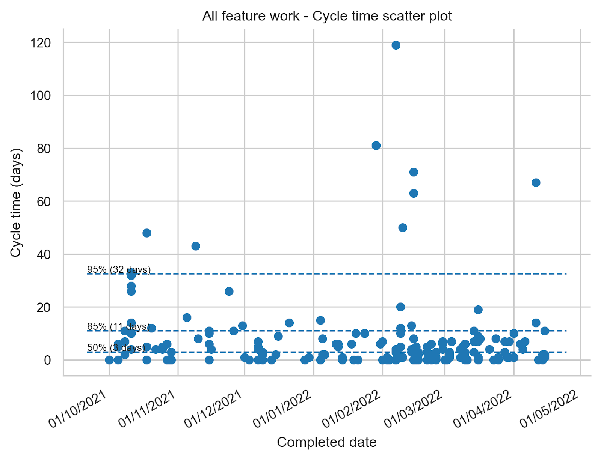
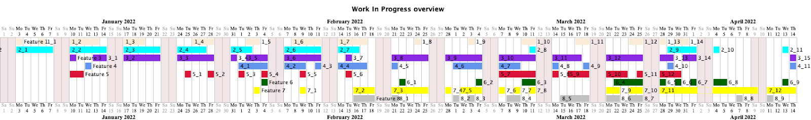
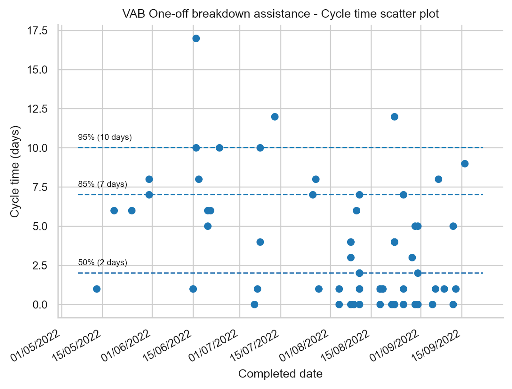

_This blog post describes how we identified and addressed the root causes of a slowdown of delivery of value._

The Olympus Mobility product development team is a multi-disciplinary team with backend developers, a web developer, mobile app developer, product designer and with the CTO and CEO sharing the product management role.

We're building the [Olympus Mobility platform(https://www.olympus-mobility.be/en/) and also work with [KBC Group](https://www.kbc.com/en.html) to integrate our services in the [KBC Mobile Banking app](https://www.kbc.be/campaigns/mobile/en/).

At the beginning of 2022 the product development team decided that it wanted to deliver faster because it had become harder to meet release dates. 

We wanted to take a step back to find out what was going on and find ways to improve. This blog post will describe the steps we took to identify the problems and how we addressed them so we could deliver value sooner with higher quality.

## 1\. Visualise work

### Work Item Level

First, we figured out how to get useful data about the work done and found ways to visualise the last month's work with the hope that it could lead us to insights.

We started looking at work item level and exported data from JIRA. A work item can be a story or a bug.

We exported the cycle time for work items for our delivery process for the period between the 1st of October 2021 and 15th of April 2022. Cycle time is the time that a work item spends as work in progress within a predefined set of process boundaries. As process boundaries we took the moment a developer picks up a work item for implementation until it is finished and ready to deploy to production. This includes time to implement the work item, have a peer review and a QA stage. We focussed on this part of the process because the people in the team felt stressed out because of the workload, context switching and lack of focus and we had reliable data.

The cycle time we calculated didn’t include the deployment to production itself because that happened every two weeks and it wasn’t tracked in JIRA with a separate workflow state.

The cycle time for all our feature work is visualised here in a cycle time scatter plot \[1\]:

 

In a cycle time scatter plot every dot represents a work item. The horizontal axis on the chart indicates when the work item was completed. The vertical axis indicates how long the work item spent in progress within the process boundaries we’ve chosen. In this plot we chose days as the unit of time.

What this chart shows us is that 50% of the work items that were completed between the 1st of October 2021 and 15th of April 2022 were completed within 3 days. 85% of all work items were completed within 11 days and 95% of the items were completed within 32 days.

The less variability there is in cycle time the more predictable you are as a team and in our case we think that 85% of work items completed in 11 days doesn’t look bad at all. 

The learnings we took from this exercise:

  * We should pay attention when ‘in progress’ work items cross the 8 – 10 days of age because it looks like once they cross this threshold they often stay in progress for a long time. We need to pay more attention to work item age and act to prevent long cycle times.
  * We can also look into the outliers to find out why they took so long and find out if they have something in common that we need to pay attention to.
  * In general we are very pleased with the cycle time of individual work items for this part of our product development process and we don’t think we need to dig any deeper right now.

### Feature level

Next we looked one level up to the feature level. With a feature we mean a larger deliverable that needs many work items to be completed before delivering value. Some  examples of features are: extend our mobile app to let users use a car sharing service or order a train ticket.

The team felt that they were working on many things at the same time and when we looked at the data this is what we found:

  * In October 2021 we worked on 5 features in parallel
  * In November 2021 we worked on 4 features in parallel but 2 of the features were new ones. For 3 of the features that we worked on in October we paused the work.
  * In December 2021 we worked on 6 features in parallel, luckily none of them were newly started.
  * In January 2022 we also worked on 5 features, none of them new.
  * In February 2022 we worked on 8 features in parallel of which 3 were new.
  * In March 2022 we worked on 8 features in parallel.
  * In April 2022 we also worked on 8 features in parallel.

We were working on more features in parallel than we had people in the team during this timeframe (7 people were part of the product development team).

So although the team did a great job at finishing individual work items we worked on many features in parallel which resulted in a long cycle time for each of the individual features.

My expectation was that we would have a low flow efficiency for the individual features due to lots of context switching. Flow efficiency for a feature is the ratio of the total active time a feature was worked on to the cycle time it took to complete the feature.

For example, if a feature took 10 days to complete but it only required 2 days of active work the flow efficiency is 20%. It means that the work spent 8 days in some inactive state.

Flow efficiency is often difficult to measure because it means we need to be able to distinguish active from inactive time. If your workflow has wait states in between every state, for example ‘development in progress’ → ‘waiting for review’ → ‘review’, and the state changes are kept up-to-date reasonably well you can calculate flow efficiency. Our workflow doesn’t have wait states but we are required to do time tracking for accounting purposes. This means we track daily how much time we spent per feature and this allows us to measure flow efficiency quite accurately.

So based on these worklogs / timesheets we were able to both calculate flow efficiency for every feature and visualise how we spent our time as a team \[2\]:

 

The image above shows a Gantt chart which is often misused to represent a project plan. Misused, because Gantt charts are typically created before the work starts. However during the product development process we still learn new things that affect the work that needs to be done and so laying out a detailed plan and estimating how long it will take beforehand is hardly ever accurate. The project plan also typically assumes 100% flow efficiency which is almost never the case.

The Gantt chart that I show here represents how we actually spent our time as a team based on the work logs. It is not at all how a predefined project plan typically looks like.

Each line in the chart represents a different feature we worked on. For the purpose of this blog post the actual feature descriptions have been renamed to generic values ‘Feature 1’, ‘Feature 2’,… If a day is coloured for a feature it means at least someone in the team logged time on the feature. It shows really well how scattered our time was spent and how it increases the cycle time for each of the features. You can see this by the many gaps and a lot of context switching.

The flow efficiency for these features for this time frame is, sorted ascending: 7%, 9%, 12%, 14%, 16%, 22%, 36%, 53%. This is because on average, things are waiting somewhere 4 times more than they’re being actively worked on!

On top of this, one stream of work that isn’t visible in the drawing is operational support. The team spent 25% of its time on unplanned work to support the operations team or help answering questions from customers or fix bugs.

As you can imagine, the team was very busy and we had a very high resource utilisation but a low flow efficiency. As a result, delivering value to our customers took longer than it should and the feeling of being overwhelmed was high due to constant context switching and feeling busy all the time without time to recover.

Some reasons why we worked on so many features at the same time:

  * Features got pushed to the team instead of pulled by the team when they were ready for new work. The reason features got pushed to the team was because release dates were agreed with partners when the work wasn’t clear yet and without leaving enough slack time for unplanned work. When a feature was agreed to be delivered 6 months from now and after 3 months a new customer wanted to sign a contract but really needed an extension to our platform it became the same priority as the planned feature and it was pushed to the team. This is totally understandable (we like new customers!) but to make it less stressful for our small team we should have left some slack in the schedule to be able to cope with unplanned requests in a sustainable way and not fill the schedule for months upfront.
  * Features got paused because some partners have release cycles with predefined dates. If a feature was almost but not completely ready for release on the predefined date it was only up for the next release in 3 months time. This meant that even when only one more week was needed to complete the feature it went dormant for almost 3 months until the partner’s release schedule allowed it to pick it up again to do final integration tests and release it. These fixed release schedules mean we unnecessarily delay bringing value to our users and also results in more work in progress and secondary needs (context switching, new people are put on the product after 3 months which lack context and need more guidance,…).

Gathering metrics and visualising the work helped us to realise something needed to change. It was clear that there was a big opportunity to deliver value sooner and with lower stress for the team.

## 2\. Stabilise

The first thing we decided as a team was that we should first finish what we were working on and not start anything new unless we needed to meet an earlier agreed release date. 

In the following weeks and months we were actually able to finalise most of the 'work in progress' features and make them available to our users which was very welcome.

In an ideal world we would work with the team on as few features or topics as feasible and focus on releasing the value to our users as soon as possible with good quality and learn from feedback. Once the team is ready for new work we decide what’s the next most important or impactful topic and we repeat. Deciding as late as possible about the next priority means we have the most context to decide what’s the most important at the moment we are ready to pick up new work.

Unfortunately we can’t always stick to this ideal way of working because we work with partners who want to commit to release dates and intermediate milestones (e.g. integration testing phase) long beforehand so we don’t always have the freedom to decide as late as possible what’s the next most important thing to work on. We need to live with these constraints and what we’ll try in this case is:

  * take past cycle times for features into account to try to get to a realistic release date
  * prioritise the work with predefined release dates first so we’ll have a high change of meeting the external constraints without too much stress
  * be cautious of new work getting pushed to the team. Switch to pulling of work when something finishes as the default mode of operation

This should result in positive outcomes for both our team (deliver with quality and without much stress) and our partners (Olympus Mobility is reliable and is meeting release dates).

## 3\. Test case: VAB one-off breakdown assistance

Soon after we came up with our findings and actions described in the previous two sections at the end of April 2022 a new release date came in sight which was already agreed upon at the end of 2021. We committed to bring the one-off breakdown assistance (OOBA) product by [<u>VAB</u>](https://www.vab.be/en) to the KBC Mobile Banking app.

OOBA is a product that allows car drivers to get help when their car breaks down.

By the end of April 2022 the discovery phase (or [<u>Fuzzy front end</u>](https://en.wikipedia.org/wiki/New_product_development#Fuzzy_front_end) phase) for OOBA was finished and we were expected to be ready with the development by the 16th of July 2022. This marked the start of the end-to-end integration test phase. The integration test phase was followed by pen tests on the 15th of August, a pilot release on the 31th of August and finally a public release on the 12th of September 2022.

We decided to let a small multi-disciplinary team focus on building the product. We thought this was the option with the best chance of getting the delivery of OOBA ready by the 16th of July.

The team started its first work item on the 12th of May and also introduced some practices which helped us meet the release dates and which I’ll describe in the next paragraphs.

We made sure we got faster feedback by introducing concurrent development. Backend and frontend developers started and worked together to get a functioning end-to-end slice ready as soon as feasible. This involved starting with API’s which returned mock content which got replaced by the real implementation as backend development progressed.

Implementing the end-to-end functionality also included integration with external parties (VAB and KBC) as soon as we could. We didn’t wait until the planned integration test phase that was scheduled months later. This all with the purpose of spotting possible integration issues sooner and to be able to finish work items and not postpone feedback.

Once some work was ready to demo we showed it at our weekly status meeting with all stakeholders. This was much appreciated and gave us valuable feedback which we often could incorporate by the next meeting.

During our daily status meeting with the Olympus Mobility team we focussed on removing blockers to prevent work from aging. We focussed on finishing what already started before starting anything new.

 

The ability to focus and the introduction of the practices described earlier resulted in a cycle time of 7 days for 85% of the work items and 10 days for 95% of the work items. Compared to what we showed for the period 1st of October 2021 - 15th of April 2022 the cycle time improved and we have less variation which means we are more predictable. The flow efficiency for the OOBA work ended up being 60%.

Mid may 2022 we also switched from our biweekly releases to Continuous Delivery (CD) for our backend and web developments. Each developer became responsible to deploy their changes to production. The cycle time for OOBA above includes deploying the changes for work items to production. Switching to CD saves us about a half a day every two weeks that we needed to deploy all changes to production in bulk. By introducing CD, we deliver value to users sooner and it has no negative impact on our availability.

We did organise our team for fast flow but we were also hugely dependent on the support of the partners we integrated with, VAB and KBC. It’s only thanks to their fast response time and feedback when debugging integration issues that we could meet these challenging release dates.

We met the release dates and the OOBA product is available from the 12th of September 2022 in the KBC Mobile Banking app. Delivering OOBA was definitely considered a success both for the product development team and the stakeholders. We are taking the learnings from the JIRA data and the process changes with us when planning and delivering future product initiatives and we’ll continue to inspect and adapt to keep improving the speed and quality of the mobility services we deliver to our users.

Copying these practices might not give the same results in your product development context but it might give you some inspiration on how to evaluate and if needed improve flow. Thanks for reading.

\[1\] : The cycle time scatter plot was created using the [jira-agile-metrics github project](https://github.com/DeloitteDigitalUK/jira-agile-metrics). It provides data that gives more insight compared to what you get out of JIRA without additional extensions or apps. You get for example percentile data about cycle times which is important as cycle time data doesn’t have a normal distribution and so the averages Jira provides aren’t helpful. Generating the data is easy but cleaning the data took quite a bit of time. We for example had work items that were used for time tracking outside of the software delivery process and which went from Todo → Done without going through the actual workflow. These and other tickets needed to get filtered to get more accurate results. Take this in mind when trying to come up with useful metrics.

\[2\] : The flow efficiency calculations and the Gantt chart are generated using the [<u>work-exposure github project</u>](https://github.com/kristofa/work-exposure).

_Many thanks go out to [<u>Tom Stuart</u>](https://www.linkedin.com/in/another-tom-stuart/) and [<u>Will Ellis</u>](https://www.linkedin.com/in/will-ellis/) for reviewing the blog post and providing valuable feedback._

_This blog post was originally posted [here](https://www.olympus-mobility.be/en/improving-the-flow-of-work/)_

