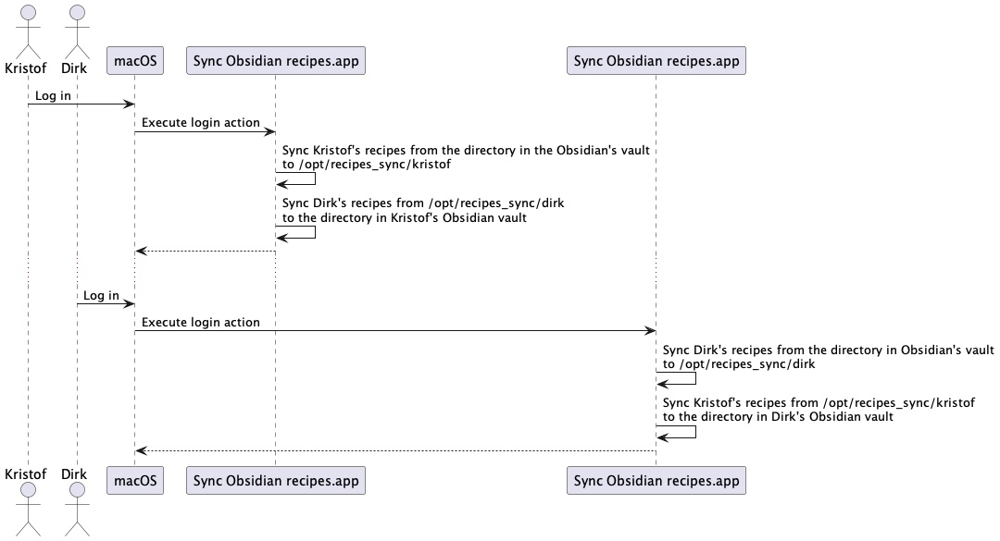

_This blog post describes how I set-up basic read-only note syncing with Obsidian (without using Obsidian Sync) for me and my partner who share the same computer._

I've been using [Evernote](https://evernote.com) for personal use with a paying account since 2011 but recently I switched to [Obsidian](https://obsidian.md). 

Evernote still worked okay for me but I was drawn to Obsidian for several reasons:

   - Obsidian notes are just Markdown files on your local disk. If Obsidian would  go out of business my notes aren't gone and I can read them with any text editor.
   - It's extensible using plugins. Obsidian [has a lot of plugins](https://obsidian.md/plugins). There is still a lot for me to explore but I'm for example using the [plantuml plugin](https://github.com/joethei/obsidian-plantuml) to easily embed diagrams in my notes which I was missing in Evernote. I also want to try out the [kanban plugin](https://github.com/mgmeyers/obsidian-kanban) and the [Web Clipper](https://stephango.com/obsidian-web-clipper) soon.
   - I really like the [Canvas](https://obsidian.md/canvas) feature. It allows you to visualise your ideas by adding notes, media files, boxes with text and link them all together in diagrams. I used it to organise all my notes around a subject in a mind map. 

I migrated all my and my partner's notes from Evernote to Obsidian using [yarle](https://github.com/akosbalasko/yarle) which worked fine. 

After the migration I noticed Obsidian has [an importer plugin](https://github.com/obsidianmd/obsidian-importer) to import notes from other tools like Evernote into Obsidian. This is probably also worth checking out if you want to start using Obsidian.

## Obsidian Sync is pricey for personal use

I set up Obsidian to use iCloud Drive to sync my notes between my Macbook, iPhone and iPad and this works as expected but one functionality that I was missing is note sharing.

Me and my partner like to cook and we both have our set of recipes that we share with each other. Notebook sharing is easy using Evernote.

Obsidian does support sharing vaults (root directory with notes) as part of the Sync product but it currently costs $8 per month per person if you need support for more than 1 vault which means it would cost us $192 / year ($8 x 2 people x 12 months) which I find too much for personal use.  

In comparison I was paying 43.99 EUR / year for Evernote personal. Paying for Evernote removed the note limit, I could use it on more than 2 devices and we could share notes. My partner was using the free version.

I didn't want to pay $192 / year just to share our recipes but I do appreciate the small team that's building Obsidian and so I supported them by paying $25 which also gives me access to beta versions and some other extras (see [Early access on this page](https://obsidian.md/pricing)). I'll probably repeat this in the future.

## Alternative basic note syncing solution - high level overview

Since Obsidian notes are just markdown files that are stored on your computer's harddrive I built some scripts to sync the recipes between our accounts using our MacBook. 


<br>


I defined a login action for both my account and my partner's user account (Dirk) which executes an application. Each of our user accounts executes a different application that is created using the macOS `Automator.app.` The application is basically just a wrapper around a shell script (more details on that later).

The script that executes when I log in does the following:

1. it syncs the directory with my recipes from my Obsidian vault in iCloud drive to a central directory on our MacBook that's accessible to both our user accounts: `/opt/recipes_sync/kristof` 
2. it syncs the directory with Dirk's recipes from the a central directory that's accessible to both our user accounts `/opt/recipes_sync/dirk` to a directory in my Obisidian vault in iCloud drive.

When Dirk logs in a similar script is executed which:

1. syncs the directory with Dirk's recipes from the Obsidian vault in iCloud drive to a central directory on our MacBook that's accessible to both our user accounts: `/opt/recipes_sync/dirk` 
2. syncs the directory with Kristof's recipes from a central directory that's accessible to both our user accounts `/opt/recipes_sync/kristof` to Dirk's Obsidian vault in iCloud drive.

## Set-up the directory structure

To set-up the directory structure in `/opt/` you should have an admin account on the MacBook:

```
sudo mkdir recipes-sync
sudo chown kristof:staff recipes-sync
# make sure both me and my partner's account can write in the directory
chmod 770 recipes-sync
```

inside `recipes-sync` :

```
kristof@Kristofs-MacBook-Pro-3 /opt/recipes-sync $ mkdir kristof

# Create Dirk's directory and make sure he is the owner and has write access
kristof@Kristofs-MacBook-Pro-3 /opt/recipes-sync $ mkdir dirk
kristof@Kristofs-MacBook-Pro-3 /opt/recipes-sync $ sudo chown dirk:staff dirk
```


## Creating shell script and execute on login 

Start the `Automator.app` which comes with macOS. 
Create a new application and add a 'Run shell script' action. 

The shell script content looks like this for my account:

```
rsync -r --delete ~/Library/Mobile\ Documents/iCloud~md~obsidian/Documents/notes/Koken\ -\ recepten/ /opt/recipes-sync/kristof/

rsync -r --delete /opt/recipes-sync/dirk/ ~/Library/Mobile\ Documents/iCloud~md~obsidian/Documents/notes/recepten_dirk/
```

Save the application somewhere in your home directory (I put it in `~/Applications`).

[rsync](https://en.wikipedia.org/wiki/Rsync) is a command-line tool that comes pre-installed with macOS and which is used to synchronise files between two locations (source to destination). In this case the full content of a directory is synced.

The `-r` option makes sure we synchronise all folders and files recursively. 

The `--delete` option makes sure that we delete files that exist in destination that do not exist in source anymore.

Because the target directory is the iCloud Drive Obsidian vault directory, iCloud makes sure the files are copied to the cloud and synched to all devices.

Next I make sure the application gets executed at login by adding the application to Preferences -> User & Groups -> Login Items. 

I replicated this process for my parter's account but with a different shell script content obviously.

*Important prerequisite:* Because we sync one parent directory all files the files that are linked from the notes like images need to be part of the directory or underlying directories that we sync. So make sure you configure Obsidian -> Preferences... -> Files and links -> "Default location for new attachments" to be either "in subfolder under current folder" or "Same folder as current file".

## Conclusion, limitations and risks

The synchronisation process described here is in place for several weeks now and I created a new recipe, my partner created some new recipes, and they successfully appear in both our Obsidian applications on all devices.

So for us this solution is good enough for now.

There are of course several limitations and risks which might not make it workable for you:

- Me and my partner share a private MacBook with two different user accounts. The syncing relies on the flexibility of macOS to define login actions and run custom made applications / shell scripts.
- The notes are only shared when we both use and log into the MacBook. We log in practically daily so that's not an issue for us.
- The sync only happens in one direction and we should only edit the recipes in our own folder. If I would edit my partner's recipes and he would edit mine the changes would be overwritten on the next sync.
- The recipes are copied from and to a fixed location in our Obsidian vaults. If we would update the location of the recipes in Obsidian we would have to update the scripts or the synching would stop working.
- We only have two user accounts on our MacBook and the recipes that we share are not secret at all but by copying to `/opt` and making the recipes available to all users part of the user group 'staff', every other regular user would be able to view and copy the notes. So it's important to not share any sensitive notes using this approach or if you do make the access more restrictive.

If you use Obsidian professionally it should be a no-brainer to pay for the Sync product which is a lot safer and doesn't have all these limitations and potential risks.

If you have any feedback, please comment [on my Mastodon post](https://computerclub.social/@KristofAdriaenssens/112546604860318987).
