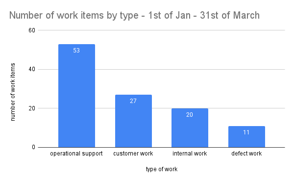

_This blog post suggests what can be done at team level to avoid overloading a team with work._

This is the 2nd blog post in a series of three about too much work in progress (WIP). In the 1st post you can read about [the consequences of overloading teams with work](https://kristofa.eu/2024-09-01-the-consequences-of-overloading-teams-with-work/). The 3rd and final post in the series will be about what you can do at organisational level to avoid too much WIP.

What I'll share in this post are things I've tried out myself and have found to be effective.

# Making work visible - the different sources of work

The leadership team might have an incomplete view of the work that's happening in a team.

Getting data on the different sources of work is important to reveal that a team might not be spending the majority of their time on initiatives to acquire new customers or to retain existing customers.  

Teams that work on a product that's in the market for some time and have a decent customer base have other types of work that can't be ignored. I've found a split in following categories to be useful:

- customer work: Work done to acquire new or retain existing customers. This is the type of work that management and leadership understandably wants us to spend the most time on.
- operational support: Work that's the result of the usage of our product. This can be questions customers have that can't be answered by the customer support team but need developer investigation. It can also be acting on alerts because systems start failing, etc. This is unplanned work.
- internal work: Work that's needed to keep the systems running or improve them. These can be initiatives to reduce operational support, improve developer experience, keep up-to-date with new software versions, fix security vulnerabilities,...
- defect work: Work to fix defects or rework after putting changes in production. This also is unplanned work.

Imagine that you label the work items with these categories, and you'll end up with this:

This gives a strong hint why the delivery of a new feature isn't going as fast as expected. It's not that the team wasn't working hard, but they're working on other things than you might think.

Once you have this data you can look into the details together with the team and find out the reasons why there is so much operational support. Some examples of things you might find:

- the customer support team is lacking a way to view certain information and needs developer support to query the database
- one of our services isn't resilient to failures and needs regular manual intervention by one of the developers to reprocess data
- a third party service we depend on is unreliable, and we need to inform them and follow up when things go wrong

Based on the findings you can define actions that can be presented to the leadership team. You can make clear that you'll first have to invest time (internal work) to reduce the operational work before the team can go faster and focus more on customer work.

Because the context in which we work is constantly changing, making our work visible and learning from it is a continuous effort that needs to be repeated regularly.

A disadvantage of this approach is that it's a lagging indicator. Ideally we should proactively take into account a balance between the different types of work during capacity planning but in reality I've practically always have seen this fail and making work visible, after the fact, was unfortunately often the only way to invest more in internal work.

John Cutler [^1] made a great drawing on how to balance different types of work during capacity planning to avoid grinding to a halt: 

![A drawing by John Cutler that shows 3 rectangles. The first rectangle on the left shows the ideal work planning scenario where you balance different types of work like Unstructured innovation/experimentation, add new capabilities, enhance existing capabilities, manage complexity, unplanned work / interruptions. It has a subtitle 'Do this ...'. The 2nd rectangle shows a capacity planning situation that should be avoided and which only has 2 types of work: the largest majority is spent on adding new capabilities and some part one unplanned work. It has a subtitle 'Not this'. Finally the 3rd rectancle with subtitle '... or this will happen' has 3 types of work. The largest section is unplanned work / interruptions and there are 2 smaller sections. One with manage complexity and one with enhance existing capabilities. ](../assets/img/2025-01-12-john_cutler_unplanned_work.jpeg)

Categorising work by the source of work is only one way of making work visible. There are countless other aspects of your work that you can make visible and which might provide useful insights.  I've shown flow metrics and work in progress in a previous blog post [^2]. I can also highly recommend the book Making Work Visible by Dominica Degrandis [^3].

Making work visible can be a real eye-opener and can be an enabler to convince the leadership team that the team needs to slow down and implement improvements before it can speed up again.

# Educate - product development is emergent

Besides not being aware of the type of work that's happening in team the leadership team might also have a wrong mental model about product development work. 

Building a software product is complex [^4]. The product and the context and constraints in which we're building will always be unique (= it's never been done before). 

In every stage of the product development process we will get feedback and learn new things that will impact the amount of work we need to do to reach your goal (unknown unknowns).

The chart above shows the number of work items that had to be completed for a new product launch, before it could be released to users and start generating value. It was a large initiative for which the delivery work started in April already.  But as you can see, even rather late in the process the number of work items still increased substantially. This is because there is a lot of uncertainty that gets uncovered while doing the work.

Examples of things that can pop-up during delivery:

- The team learns that an API of a third-party service they planned to use isn't behaving as documented so they have to look for an alternative. 
- During a demo of the unfinished product it becomes clear that the onboarding flow can be shortened and improved. During the discovery phase the length of the onboarding flow came up as a risk so with this new insight, it's worth updating the onboarding flow before launch.
- A potential case of abuse is revealed by the developers which needs to be fixed prior to launch.

If you tracked the number of work items over time for every reasonable sized initiative you'll run into the same pattern. We keep on learning and receiving feedback during the full product development process which results in new work.

It also means that discovery and delivery can't be fully separated. During delivery new challenges are found which need collaboration and involvement between business / product / design / developers to decide on the way forward.

A deterministic mindset is not compatible with software product development. Fixed release dates with a fixed scope make no sense. There are cases, for example due to a contractual obligation, that a pre-defined release date with a fixed scope must be met to prevent fines or other penalties, but these should be exceptions.

Setting and sticking to an unrealistic release date will likely result in a worse product with lower quality and will result in more rework after launch. Building trust by showing progress, making work visible and explaining why new work pops up should help to create awareness and change the leadership's view on how to plan work.

# Set limits and say no

Once you've made work visible and created awareness about the nature of product development work it should hopefully result in more realistic work scheduling that better aligns with the capacity of your teams.

Ideally you move into a situation where a team can pull new work when they're finished with something but if you're still structurally getting too much work pushed to the team your must protect your team by setting limits and saying no. You can define a max number of parallel work streams for planned work (e.g. max number of new features in parallel) and set aside capacity for urgent unplanned work.  

What I've seen working for dealing with unplanned work is introducing a weekly rotating firefighter role. The developer who takes up the role knows they can be interrupted and because it's a rotating role everyone gets its fair share and knowledge about the unplanned work is shared.

Setting limits for a max number of parallel work streams forces priority setting, so work can be sequenced. The result will be that you deliver value sooner and with higher quality.

An indication that you should set limits and reduce the parallel work is if there is little collaboration and most people in the team work on different things. In that case you don't have a team anymore but a set of individuals. If that's the case you have no knowledge sharing, it's likely that quality will suffer due to a lack of collaboration, and you neglect the growth of especially less experienced team members if everyone is working by themselves. 

If there's enough valuable work to be done but too much for the team to handle you can suggest growing and splitting the team, so more work can be done in parallel and there are less conflicting priorities. But more on that in the next blog post about what can be done at organisational level.

# Practice - continuous probabilistic forecasting

If you set no limits on the work that gets started and too much work gets pushed you will not be predicable and no way of estimation or forecasting will be accurate.

But if you do limit WIP and you want to get an idea when work on an initiative will be done by far the best option I know is probabilistic forecasting. Probabilistic forecasting takes past throughput (the number of work items completed per unit of time, e.g. in a day, in a week, etc.) as input to forecast potential future outcomes. 

For probabilistic forecasting to work accurately there are a set of assumptions that must hold true. We assume that the throughput of the past is representative for the future and while we don't expect that all work items are equally sized, which is unrealistic anyway, probabilistic forecasting will be more accurate if variability is not too high. 

If you want to experiment with probabilistic forecasting I highly recommend Daniel Vacanti's books and the podcast by Daniel and Prateek Singh [^5]. 

![Shows a burn up forecast chart. It contains a timeline starting in August 2022 and ending in May 2023. If shows a line with the backlog items, the items to be completed and a line with done items over the timeframe. It also shows the result of a Monte Carlo simulation done on the 11th of April 2023. For every Monte Carlo simulation is shows a fine line resulting in a potential release date when our target is to finish 39 work items. It also shows the different probabilities. 50% chance of finishing 17th of April 2023, 85% chance of finishing 25th of April 2023 and 95% chance of finishing on the 30th of April 2023. It also shows an arbitrary deadline of 1st of May 2023 and so with the forecast of 85% probability we have 6 slack days.](../assets/img/2025-01-12-burnup-forecast_11th_april_2023.png)

The forecasts in the chart above are generated using Monte Carlo simulations [^6]. The chart shows that at the time of running the forecasts, 11th of April, we finished just above 30 work items, and we forecast by when we can complete 39 work items. It highlights that we have 85% chance to finish the work items by 25th of April based on our historical throughput. The arbitrary deadline date that is shown in the chart, 1st of May 2023, is our target date when we hope to finish the work items that let us reach our goal.  In this case it shows that with 85% probability we'll end up 6 days sooner. The chart also shows 50% and 95% probabilities (respectively 17th of April and 30th of April). You can also see that the target number of items and the completed number of items are converging which is good and to be expected quite late in the lifecycle of the initiative (you can see that we completed the first work items end of February 2023).

Once you have a tool to automate these simulations, a forecast can be done in minutes.  You select a set of relevant finished work items (the reference data of the past), set the target (how many items to complete) and decide how many simulations to run which will give you the different possible outcomes with probabilities.

![An arc diagram showing a timeline starting on 06th of June and ending on 01st of November with increments of 4 days. It shows the results of probabilistic forecasts on 5 different days. It connects the dates of the forecast with the forecasted release date with 85% probability. We see a forecast date of 6th of June ending with with a forecast of 30th of September. We see 4th of July ending up with a forecast date of 22nd of September, 17th of August ending up on 28th of October, 25th of August ending up on 8th of October, 14th of September ending up on 8th of October also.](../assets/img/2025-01-12-probabilistic_forecasts_example.jpg)

The arc diagram above shows such different forecasts for an implementation of a new product. The first forecast on the 6th of June resulted in a 85th percentile probability to finish a set of work items by 30th September.  The 2nd forecast on the 04th of July results in 22nd of September etc. We ended up releasing on the 17th of October which is not too far off.

Having frequent updated release date forecasts gives us new information and the option to make decisions. We could decide to postpone certain work items so we can deliver value sooner. We could decide to add additional developers to speed up the work if that can be done effectively etc.

The time that I let my teams use story point estimations luckily lays quite far behind me. A former colleague of me dug deeper in the effectiveness of story points and showed that in the data that he used there was almost no correlation between cycle time and story points [^7].  We are generally bad at estimating how long something will take, and we can't take unknowns like waiting or blocked time into account while historical throughput does include this.

The advantage of using probabilistic forecasting is that it relies on historical data and not on guessing, and because we can do it with few efforts we can do it often which means we take new information into account like an increase in work items or a change in throughput which gives us feedback to make decisions. Finally, it's a great fit for forecasting software  product development work because a lot of uncertainty is involved.

# Conclusion

If your team has a too much WIP there are things in your control at team level to improve the situation. 

You can create awareness and show the need to balance different types of work by making work visible. You can educate your organisation about the emergent nature of product development work and share examples. It is important to set limits according to the capacity of the team and if you are asked about expected delivery dates for large features or new products I can recommend learning more about flow metrics and trying continuous probabilistic forecasting.

In the next and final post in this series I'll share what can be done at organisational level to avoid overloading teams with work which will have the most impact.

_If you want to give feedback or ask questions about this post, you can either do so on [Mastodon](https://computerclub.social/@KristofAdriaenssens/113836850101298451) or [LinkedIn](https://www.linkedin.com/feed/update/urn:li:activity:7285558153293824001/)._

------

[^1]: Unfortunately I can't find the original post of John Cutler back where I found the image. I have [a link to a tweet](https://twitter.com/johncutlefish/status/1622093852969680896), but it's not available anymore. You can find more by John Cutler [here](https://substack.com/@cutlefish).

[^2]: [Improving the flow of work at Olympus Mobility](https://kristofa.eu/2022-10-18-improving-the-flow-of-work/)

[^3]: [Making work visible by Dominica Degrandis](https://itrevolution.com/product/making-work-visible/)

[^4]: Two of my former colleagues, Thijs Morlion and Robert Stöhr wrote a post about the Cynefin framework, describing the different decision domains and how to approach them: [Elevated decision making: The Cynefin framework](https://theagilemindset.substack.com/p/elevated-decision-making-the-cynefin).

[^5]: Daniel Vacanti wrote books on flow metrics and probabilistic forecasts: [When Will It Be Done](https://www.goodreads.com/book/show/40681093-when-will-it-be-done) and [Actionable Agile Metrics for Predictability: An Introduction by Daniel Vacanti](https://www.goodreads.com/book/show/25867120-actionable-agile-metrics-for-predictability). He also has a podcast named [Drunk Agile](https://www.youtube.com/channel/UC758reHaPAeEixmCjWIbsOA) together with Prateek Singh.

[^6]: I used to use [jira-agile-metrics](https://github.com/DeloitteDigitalUK/jira-agile-metrics) to generate these forecasts using [Monte Carlo simulations](https://en.wikipedia.org/wiki/Monte_Carlo_method) but the project is unmaintained and is getting more difficult to get to work. Commercial alternatives are [ActionableAgile Analytics](https://www.55degrees.se/products/actionableagileanalytics) by 55 degrees and [Nave](https://getnave.com). Both products integrate with Jira or Azure DevOps, support exposing flow metrics in different ways and are able to do probabilistic forecasts.

[^7]: [Stop estimating, start forecasting by Thijs Morlion](https://medium.com/in-the-pocket-insights/stop-estimating-start-forecasting-b275f9f81c45)
